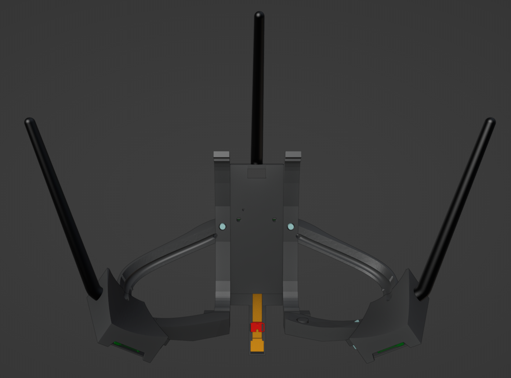

# ETVR_BABBLE_Q2_mount

| | | |
| :---: | :---: | :---: |
|  |  |  |

A mount for the oculus quest 2 intended to support two [EyeTrackVR](https://github.com/EyeTrackVR/EyeTrackVR) trackers and one [Project Babble](https://github.com/SummerSigh/ProjectBabble) tracker with one power connector, zero glue, and minimal visible cables

# THIS PROJECT IS IN BETA AND WILL BE UPDATED OVER TIME

### BOM

| item                                               | qty |
| :---                                               | :---         |
| m3x8 SHCS                                          | 18           |
| m3 heatset                                         | 18           |
| espcam modules                                     | 3            |
| antenna                                            | 3            |
| v4 led pcbs                                        | 9            |
| v4 driver board                                    | 1            |
| 160deg night ver cameras                           | 2            |
| 120deg  cameras with ir filter removed             | 1            |

